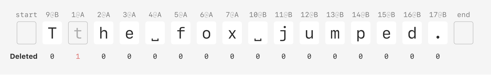
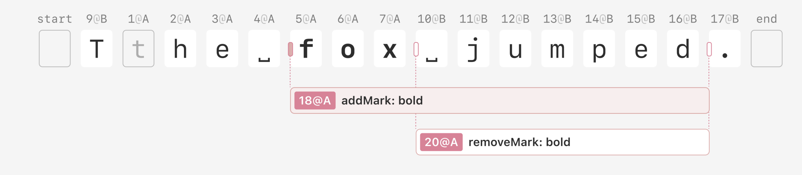

# Documentation

## Operations supported:

### Plaintext operations:



- **insert**: inserts text

```json
{
  "action": "insert",
  "opId": "2@A", // format => logical time + '@' + replica id
  "afterId": "1@A",
  "character": "x"
}
```

- **remove**: deletes text

```json
{
  "action": "remove",
  "opId": "2@A", // format => logical time + '@' + replica id
  "removeId": "1@A"
}
```

### Richtext operations



- **addMark**: add font style like: bold, underline, italic

```json
{
  "action": "addMark",
  "opId": "18@A", // format => logical time + '@' + replica id
  "start": { "type": "before", "opId": "5@A" },
  "end": { "type": "before", "opId": "17@B" },
  "markType": "bold"
}
```

- **removeMark**: remove font style like: bold, underline, italic

```json
{
  "action": "removeMark",
  "opId": "20@A", // format => logical time + '@' + replica id
  "start": { "type": "before", "opId": "10@A" },
  "end": { "type": "before", "opId": "17@B" },
  "markType": "bold"
}
```
